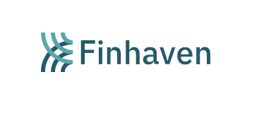
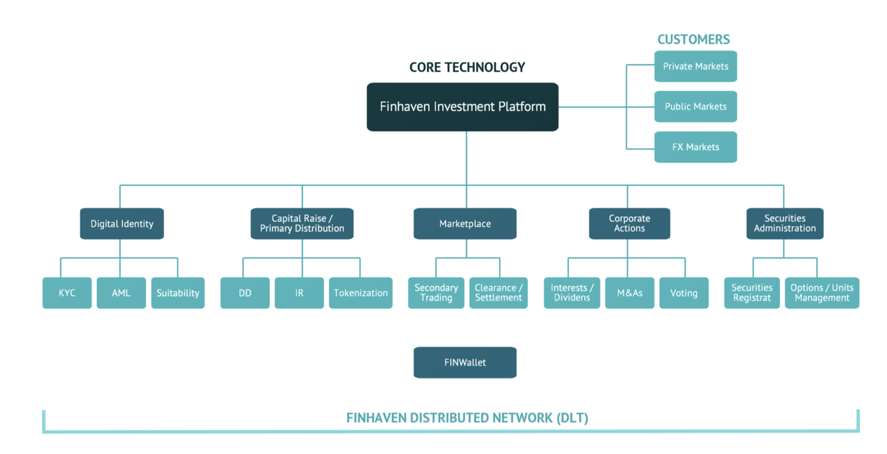

# **Blockchain Case Study**
---

Finhaven Technology Inc is a  Vancouver-based financial services and technology company with a capital markets technology platform built on blockchain technology. 

Finhaven Private Markets is a first-of-kind private marketplace built on distributed ledger technolgy that is  authorized by various Canadian regulators to operate a digital securities platform.

The private marketplace connects companies to new sources of capital and provides increased trading opportunities for security-holders of private companies. Accredited investors and permitted clients who meet assets and/or income thresholds in securities legislation can invest in digital securities offered by non-reporting issuers (whose securities do not trade publicly), hold them in a digital wallet, and trade those digital securities among themselves by way of privately negotiated trades.

**Headquarters** :  Vancouver, Canada  
**No of Employees** : 15-20  
**Funding**: $7.9 CAD million in seed and Series A funding led by Dunamu & Partners,with participation from Lanebury Growth Capital Ltd., Medici Leading Enterprise Fund and TheVentures  

---

## **Vision**
To create  highly efficient private markets. Finhaven aims become a leader in the transition of global capital markets and stock exchanges from a book-based system to a digital capital market system — with real time settlement and the elimination of clearing agencies, central depositories and custodians.

---
## **Key People**

* DH Kim, CEO & Director
* Sandra Jakab, Chief Compliance Officer
* Jason Burrows, Chief Technology Officer
* Farooq Moloo, Managing Director - Investment Banking
* Artemij Voskobojnikov, Blockchain Scientist

---
## **Technology**

The company has developed Finhaven Investment platform that leverages blockchain technology and digital securities. The platform covers major activities in capital markets - KYC/AML, suitability, raising capital, primary distribution, trading of securities, clearing & settlement and corporate actions. 

The system allows for real time settlement and eliminates the need for external clearing agencies, central depositories and custodians.

---
## **Why This Matters**
In the traditional capital markets, if a company wants to go public (IPO), it must bear underwriting fees, legal fees, accounting fees, securities exchange registration fees and other costs. Apart from these fees, the company has bear the compliance cost in terms of requirements to be met. Considering these fees, going public doesnot make sense for many private companies. 

The biggest challenge facing accredited investor, who has invested in a private company is to find buyers, as there are no reasonable avenues for private share sale.

The company aims to address the inefficiencies in the private markets through leveraging blockchain i.e. tokenization of securities.  In theory, it allows for the buying and selling of tokens (that represent securities) on a blockchain, which could eliminate the need for transfer agents, custodians and clearing agencies through secure digital settlements.

In practice, the company provides a market place, where accreditor investor can buy/sell private securities and companies can raise capital.  Both the transactions take place without need of middlemen through safe, secure, regulated digital transactions — reducing inefficiency for issuers and investors alike.

---

## **Why This May be Interesting**
The company is first-of-its-kind private market place to provide a platform for accredited investor to buy/sell private securities and private companies to raise additional funding. The company is on precipice of disrupting existing capital market infrastructure by eliminating the need for custodians, depositories and clearing & settlement agencies. 

---
## **References**
* [Vancouver Tech journal](https://www.vantechjournal.com/p/finhaven-private-markets-blockchain)
* [Finhaven.com](https://www.finhaven.com/)
* [hackernoon](https://hackernoon.com/how-blockchain-can-disrupt-private-equity-and-capital-markets-31k37gj)
* [Finextra](https://www.finextra.com/pressarticle/85931/private-securities-marketplace-finhaven-private-markets-launches-across-canada)
* [Betakit.com](https://betakit.com/finhaven-raises-6-6-million-series-a-to-build-tokenized-securities-exchange/)
* [Crunchbase metrics](https://www.crunchbase.com/organization/finhaven/signals_and_news)